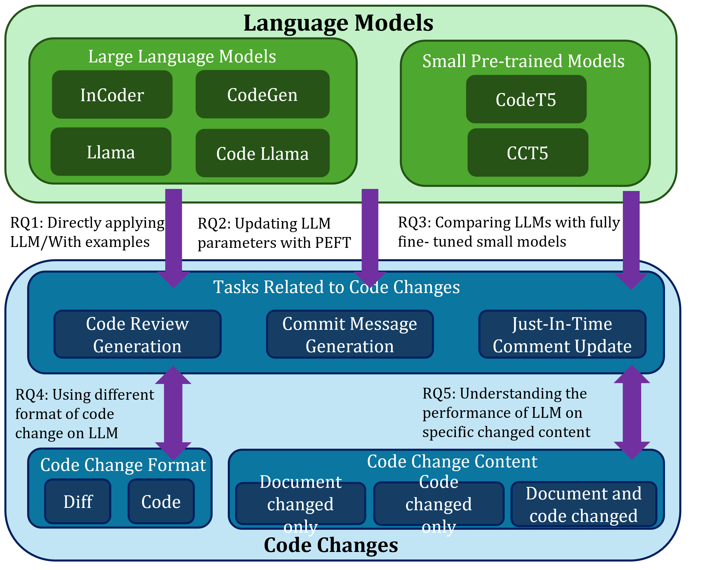

# Exploring the Capabilities of LLMs for Code Change Related Tasks
## Getting Started

The overview of our work.


We designed 5 RQs to do our research.
### For RQ1 

```bash
torchrun ./ICL_shot.py --model_path $model_path --task $task --input_form diff --num_shot $shot --model_max_length 1024 --lang $lang
```
Tasks can be selected from CodeReview, CommitMsgGeneration, JITCommentUpdate.

And lang only for CommmiMsgGeneration, can be selected from java, python, cpp, csharp, javascript


### For RQ2

```bash
torchrun ./finetune.py --model_path $model_path --peft_method $peft_method --task $task --input_form diff --langs $langs  
```

### For RQ3 

```bash
torchrun ./ICL_shot.py --model_path $model_path --task $task --input_form code --num_shot $shot --model_max_length 1024 --lang $lang
```

```bash
torchrun ./finetune.py --model_path $model_path --peft_method $peft_method --task $task --input_form code --langs $langs  
```

### For RQ4
For CodeT5
```bash
python run_exp.py --model_tag codet5_base --task $task --sub_task python
```
And for code/diff input format, you need to uncomment/comment the line of 32-35 in _utils.py.

For CCT5, follow the original run commend, take CommitMSGGeneration task for example:
```bash
bash scripts/finetune_msggen.sh -g $GPU_ID -l [cpp/csharp/java/javascript/python/fira]
```
For code/diff input format, you need to uncomment/comment the line of 1902-1903 in utils.py.

### For RQ5
```bash
python data_ana.py
```

### Data
https://drive.google.com/file/d/1-CaCNXoUu4HBRPIDIEQYXByr6y33xXIV/view?usp=sharing


